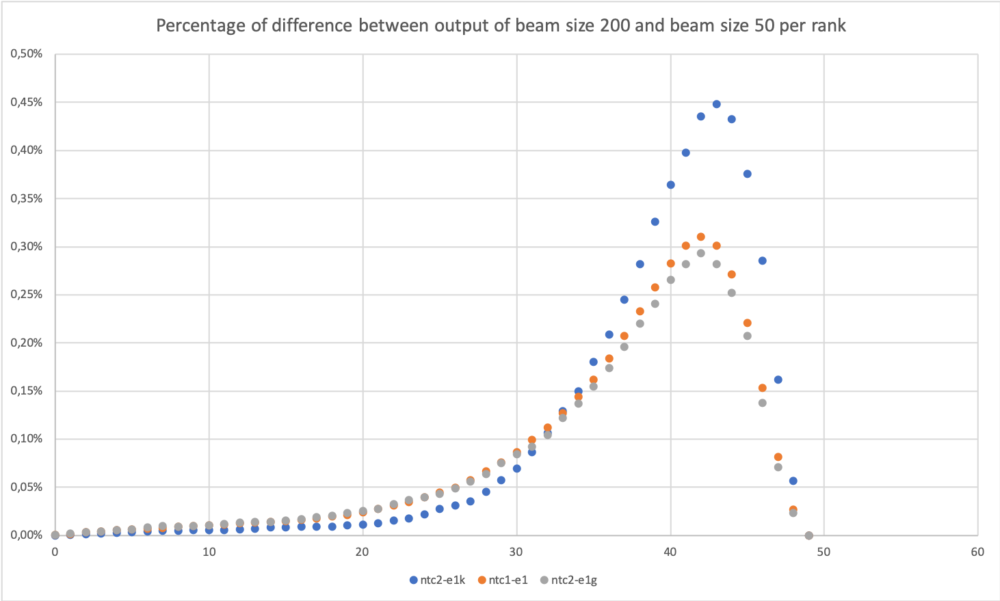

# Describing NTCIR

## Models performance

#### ntc1-e1

| P@10 | R@10 | F@10 | MAP  | model |
| ----:| ----:| ----:| ----:| --- |
|  5,0 | 11,6 |  6,9 |  6,7 | RNN |
| 11,2 | 24,6 | 15,1 | 14,7 | TopicRank |
| 12,2 | 27,3 | 16,6 | *16,3* | MultipartiteRank |
| 13,1 | *29,6* | 17,9 | 15,2 | PositionRank |
| **26,7** | 20,2 | *21,8* | 15,1 | CorrRNN |
| *16,3* | **37,0** | **22,3** | **23,9** | CopyRNN |

#### ntc2-e1g

| P@10 | R@10 | F@10 | MAP  | model |
| ----:| ----:| ----:| ----:| --- |
|  4,7 | 11,1 |  6,5 |  6,5 | RNN |
| 11,5 | 25,7 | 15,6 | 15,4 | TopicRank |
| 12,6 | 28,6 | 17,2 | 17,1 | MultipartiteRank |
| 13,3 | 30,6 | 18,3 | 15,6 | PositionRank |
| *15,7* | *35,1* | *21,3* | *21,0* | CorrRNN |
| **16,7** | **38,2** | **22,8** | **24,7** | CopyRNN |

#### ntc2-e1k

| P@10 | R@10 | F@10 | MAP  | model |
| ----:| ----:| ----:| ----:| --- |
|  4,3 |  7,4 |  5,3 |  4,2 | RNN |
| 11,2 | 19,1 | 13,7 | 11,0 | TopicRank |
| 12,3 | 21,3 | 15,2 | 12,5 | MultipartiteRank |
| 11,3 | 19,9 | 14,0 | 10,0 | PositionRank |
| *15,2* | *26,0* | *18,7* | *15,6* | CorrRNN |
| **17,1** | **29,6** | **21,1** | **20,1** | CopyRNN |


## Describing features

| dataset   | nature        | #doc  | #test  | #kp (test) | #words (test) | %abs (test) |
| --------- | ------------- | ----: | -----: | ---------: | ------------: | ----------: |
| ntc1-e1   | Abstract      | 187,080| 185,061 | 4.5      | 120.0         | 36.9  |
| ntc2-e1g  | Abstract      | 77,433 | 75,081  | 4.5      | 123.8         | 36.0  |
| ntc2-e1k  | Project desc. | 57,545 | 57,443  | 6.1      | 284.6         | 36.7  |


## Beam search is correlated to the MAP

#### ntc1-e1

| P@10 | R@10 | F@10 | MAP  | model | beamsize |
| ----:| ----:| ----:| ----:| --- | --- |
|  5,0 | 11,6 |  6,9 |  6,7 | RNN | beam50 |
|  5,0 | 11,6 |  6,9 |  **6,9** | RNN | beam200 |
| 16,3 | 37,0 | 22,3 | 23,9 | CopyRNN | beam50 |
| 16,3 | 37,0 | 22,3 | **24,3** | CopyRNN | beam200 |

#### ntc2-e1g

| P@10 | R@10 | F@10 | MAP  | model | beamsize |
| ----:| ----:| ----:| ----:| --- | --- |
|  4,7 | 11,1 |  6,5 |  6,5 | RNN | beam50 |
|  4,7 | 11,1 |  6,5 |  **6,6** | RNN | beam200 |
| 16,7 | 38,2 | 22,8 | 24,7 | CopyRNN | beam50 |
| 16,7 | 38,2 | 22,8 | **25,1** | CopyRNN | beam200 |

#### ntc2-e1k

| P@10 | R@10 | F@10 | MAP  | model | beamsize |
| ----:| ----:| ----:| ----:| --- | --- |
|  4,3 |  7,4 |  5,3 |  4,2 | RNN | beam50 |
|  4,3 |  7,4 |  5,3 |  **4,4** | RNN | beam200 |
| 17,1 | 29,6 | 21,1 | 20,1 | CopyRNN | beam50 |
| 17,1 | 29,6 | 21,1 | **20,6** | CopyRNN | beam200 |



Les différences entre la sortie du beam 200 et du beam 50 apparraissent en majorité entre les rangs 30 et 50.

Dans le top 10 il y a en moyenne 0.06% de termes-clés différent entre les deux méthodes de beam (0.20% pour le top 20; 0.65% pour le top 30; 4.45% pour le top 50). Ce qui explique la faible différence de performance pour les PRF@10.


```python

d = {}
for dat in ['ntc1-e1', 'ntc2-e1g', 'ntc2-e1k']:
    with open(dat + '.test.jsonl') as f:
        nb_doc = 0
        nb_word = []
        nb_kp = []
        nb_abs = []
        for line in tqdm(f):
            nb_doc += 1
            line = json.loads(line)
            if 'keyword' not in line:
                continue
            content = line['title'] + ' . ' + line['abstract']
            content = tsjl(content)
            line['keyword'] = [kw.split(',') for kw in line['keyword'].split(';')]
            _, _, abse = split_abs_prs_one((0, line['keyword'], content))
            nb_word.append(len(content.split(' ')))
            nb_abs.append(len(abse) / len(line['keyword']))
            nb_kp.append(len(line['keyword']))
    mean = lambda x: sum(x) / len(x)
    d[dat] = {'nb_doc': nb_doc, 'nb_test': len(nb_word),
              'abs': nb_abs, 'kp': nb_kp, 'word': nb_word,
              'per_abs': mean(nb_abs), 'nb_kp': mean(nb_abs), 'nb_word': mean(nb_word)}
    with open('stats.json', 'w') as f:
        json.dump(d, f)
```
