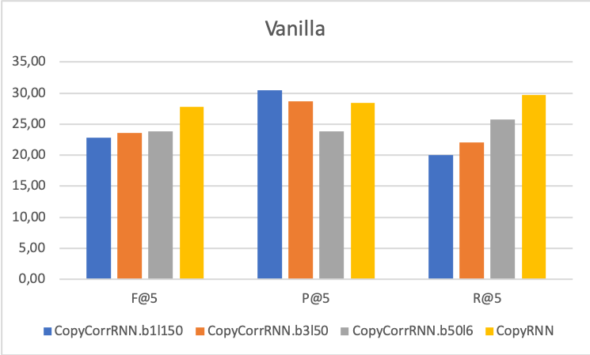
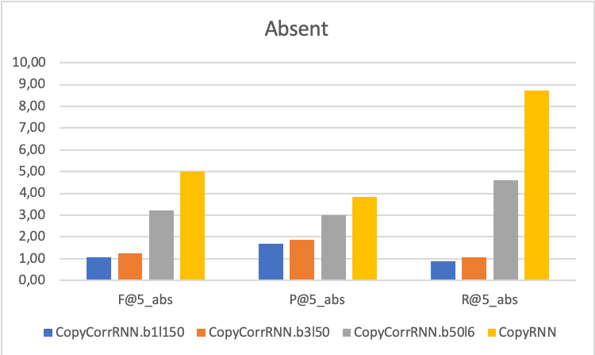
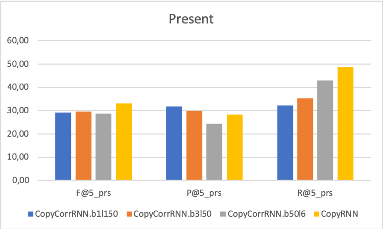

# Sets

Until now we generate uncorrelated lists of keyphrases using a beam search or sequentially output them and evaluate the 5 or 10 best.

But keyphrases are correlated to each other and form a set.

- invariant under permutation
- the size of a set is not fixed
- no duplicates

How to evaluate the fact that

## CopyCorrRNN

A BeamSearch using long decoding sequence will wield more precise keyphrases.
This does no seem to go along with the intuition of the review mechanism which allegedly prevent the model from repeating itself.
Here the model repeat itself very much but at least it is precise ?

DIVERSE BEAM SEARCH: DECODING DIVERSE SOLUTIONS FROM NEURAL SEQUENCE MODELS
A Simple, Fast Diverse Decoding Algorithm for Neural Generation https://arxiv.org/pdf/1611.08562.pdfm

if not os.path.isabs(path):
	path = os.path.realpath(path)
path = "\\?\" + path

## Vanille

| 28.2290 | 29.6335 | 27.6411 | 28.5415 | KP20k CopyRNN |

## Div Parent

| 29.5341 | 27.5544 | 27.1185 | 20.8735 | KP20k DivParent g03 |

Choosing g ??

| P       | R       | F       | MAP     |                           |
| *30.3581* | 27.8680 | 27.6338 | 21.0412 | KP20k.valid.g01.stem.json |
| 30.2698 | 27.9354 | 27.6411 | 21.1005 | KP20k.valid.g02.stem.json |
| 30.1903 | 28.0039 | *27.6559* | 21.1573 | KP20k.valid.g03.stem.json |
| 30.1178 | 28.0408 | 27.6527 | 21.1911 | KP20k.valid.g04.stem.json |
| 30.0333 | 28.0755 | 27.6420 | 21.2219 | KP20k.valid.g05.stem.json |
| 29.8279 | 28.1066 | 27.5943 | 21.2551 | KP20k.valid.g07.stem.json |
| 29.6533 | *28.1122* | 27.5357 | *21.2692* | KP20k.valid.g09.stem.json |

## SSG-S

| 31.9915 | 18.7725 | 21.3523 | 13.4714 | KP20k SSG-S |